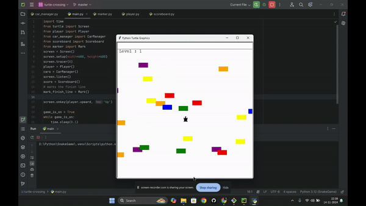

# CROSSYROAD Game

CROSSYROAD is a fun Python game inspired by the popular "Crossy Road" mobile game. The goal is to navigate a character across a busy road filled with obstacles like cars and rivers. The game is developed using Python and the Pygame library, offering a simple yet engaging experience.

## DEMO




## Features

- **Endless Gameplay**: The game continues until the player is hit by a car or falls into the river.
- **Obstacle Mechanics**: Includes cars, trucks, and rivers as obstacles to avoid.
- **High Score System**: Track your best score.

## Requirements

- Python 3.x

## Installation

To run CROSSYROAD on your local machine, follow these steps:

1. **Clone the Repository**:
   ```bash
   git clone https://github.com/dipeshluitel/CROSSYROAD_game.git
